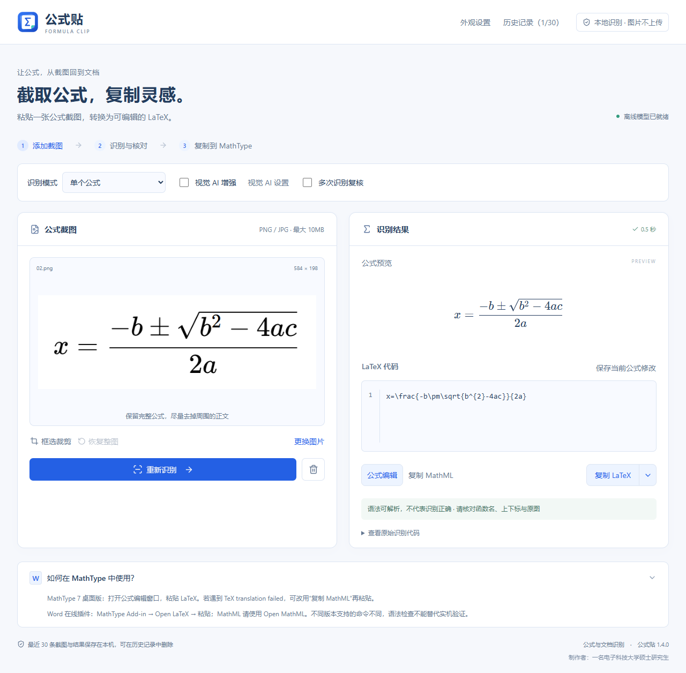

# 公式贴

**截图变公式，一贴就好。**

面向论文与教材的 Windows 公式识别工具。粘贴截图，核对公式，复制 LaTeX 或 MathML，继续在 MathType 中编辑。

[下载 Windows 安装包](https://github.com/jaycent20/shishi-formula-ocr/releases/latest) · [更新日志](CHANGELOG.md) · [反馈问题](https://github.com/jaycent20/shishi-formula-ocr/issues)

> 本仓库只分发桌面安装包、截图与使用说明，不提供新版项目源码。无需下载仓库或运行安装脚本。

## 安装与更新

1. 打开上方下载页，下载 **GongshiTie-Setup-1.4.0-x64.exe**。
2. 双击按向导安装，从桌面打开“公式贴”。支持 Windows 10/11 x64，不需要 Python、Node.js 或独立显卡。
3. 等待离线模型就绪，粘贴或拖入公式截图即可开始。

后续更新说明：已有“拾式”或“公式贴”的用户，保存当前公式并关闭旧版后，在原目录覆盖安装。历史和设置保存在 `%APPDATA%\Shishi\data`，无需手动迁移或改名。安装包未作数字签名，下载时请核对本仓库地址；下载页附 SHA256 校验文件。

## 看看界面

深色主题 · 更大字号 · 紧凑布局

## 可以做什么

| 功能 | 使用方式 |
| --- | --- |
| 离线识别 | Ctrl+V 粘贴、拖入或选择 PNG/JPEG；框选裁剪后识别单个印刷体公式。 |
| 公式编辑 | 修改 LaTeX，或通过可视化编辑器插入分式、根号、上下标、积分与矩阵。 |
| LaTeX / MathML | 复制公式正文或选择六种 LaTeX 格式；支持 MathML 导出。 |
| 多次识别复核 | 疑似错误自动复核，也可主动勾选。对照原图选择候选，不盲目修改除法或字母。 |
| 本地历史 | 保留最近 30 条记录，重新打开后可修改、保存和删除。 |
| 自定义外观 | 浅色、深色或跟随系统；四种强调色、三档字号、舒适或紧凑布局，保存后重启仍有效。 |
| 文档与视觉 AI | 配置支持图片的视觉服务后，可识别多个公式与文字。默认关闭，普通公式识别无需该服务。 |

## 识别结果需要核对

语法可解析不等于数学含义正确。小字号、相连的斜体字母和图片留白都可能影响模型，例如 `erfc` 可能被误读为 `erf/c`。

1.4.0 会对疑似异常进行不同留白的真实模型复核。出现不同结果时展示候选，点击后替换当前公式；需要保留修改时再点击“保存当前公式修改”。复核未发现差异也不能保证正确。请重点检查函数名、正负号、上下标与根号范围。

## 复制到 MathType

- MathType 桌面版：在公式编辑窗口粘贴 LaTeX；若目标版本不支持，可尝试其 MathML 导入方式。
- Word MathType Add-in：使用 Open LaTeX / Open MathML 导入入口。
- 默认复制按钮输出公式正文，不附美元符号。不同版本兼容性不同，导入后仍需核对。

## 隐私与发布方式

普通识别、预览和历史均在本机处理。视觉 AI 只有在配置并使用时，才会向所配置的服务发送当前图片；外部服务可能收费并有自身隐私条款。配置文件中的 API 密钥请勿分享。

需要源码请发邮箱私聊。旧版已公开代码的 MIT 授权不受影响，第三方组件保留原许可证。详见 [分发说明](DISTRIBUTION.md)。GitHub 自动生成的 Source code 下载仅包含本仓库的说明和图片，不包含应用源码。

制作者：一名电子科技大学硕士研究生
