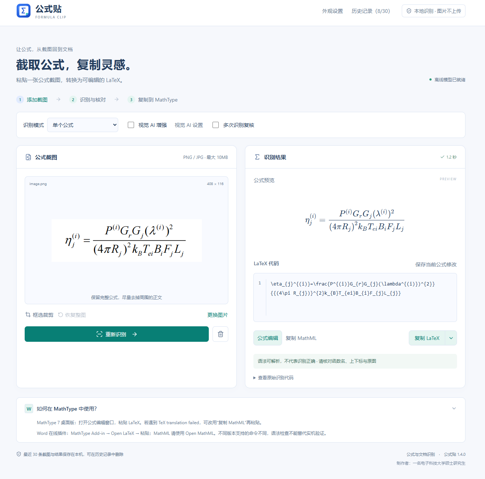
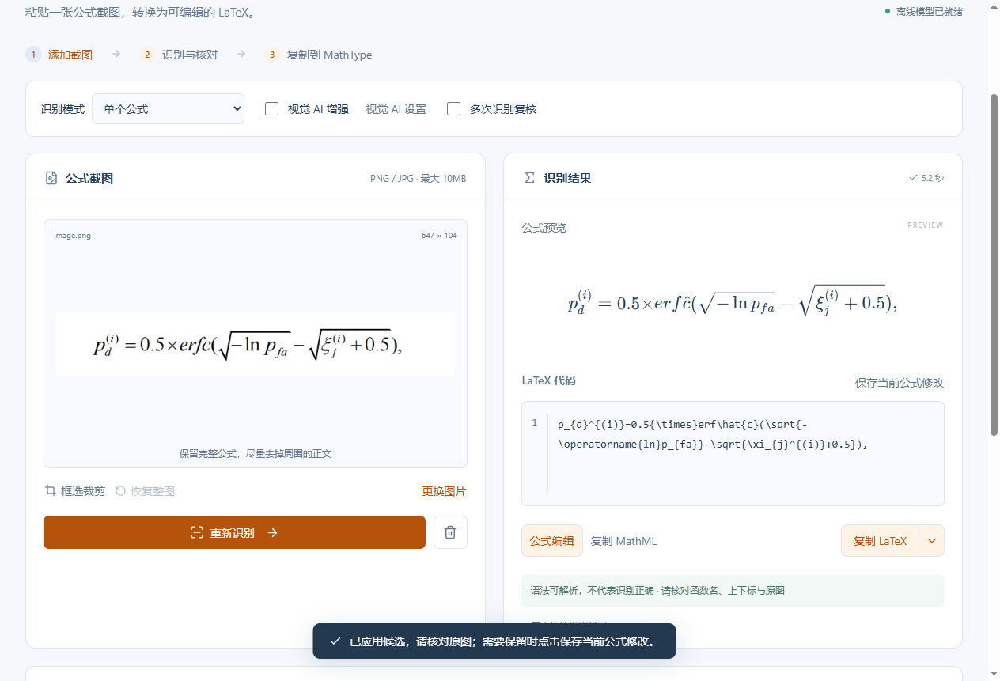
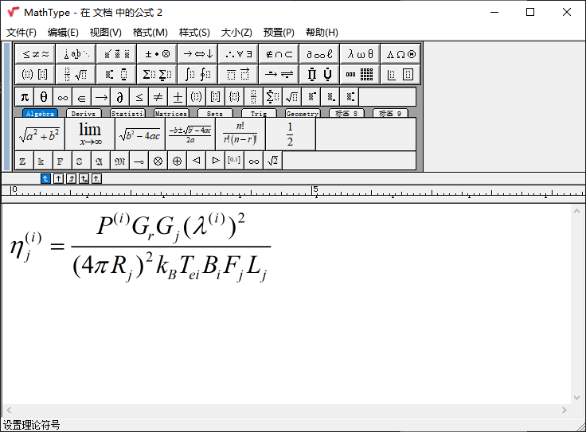

# 公式贴

**截图变公式，一贴就好。**

**Windows 桌面版 · 本地离线识别 · LaTeX / MathML · 可视化编辑**

面向论文与教材的 Windows 公式识别工具。粘贴截图，核对公式，复制 LaTeX 或 MathML，继续在 MathType 中编辑。

[下载 Windows 安装包](https://github.com/jaycent20/shishi-formula-ocr/releases/latest) · [更新日志](CHANGELOG.md) · [提建议 / 报问题](https://github.com/jaycent20/shishi-formula-ocr/issues/new/choose)

> 本仓库只分发桌面安装包、截图与使用说明，不提供新版项目源码。无需下载仓库或运行安装脚本。

## 目录

**第一次使用：** [下载安装](#installation) → [识别与核对](#review) → [修正小错误](#manual-correction) → [复制到 MathType](#mathtype)

| 章节 | 内容 |
| :--- | :--- |
| [一、开发初衷](#motivation) | 为什么做这个本地工具 |
| [二、安装与更新](#installation) | 下载安装、覆盖升级与数据位置 |
| [三、界面预览](#screenshots) | 浅色界面与深色主题 |
| [四、主要功能](#features) | 识别、编辑、复制、历史与外观 |
| [五、视觉 AI 配置](#vision-ai) | 获取密钥、填写接口、调用与排错 |
| [六、识别复核](#review) | 查看首次结果和两个额外候选 |
| [七、手动修正公式](#manual-correction) | 直接修改错误字符，保存后复制 |
| [八、导入 MathType](#mathtype) | 桌面版与 Word 插件的使用入口 |
| [九、建议与反馈](#feedback) | 提交功能建议或使用问题 |
| [十、隐私与发布方式](#privacy) | 图片与密钥的保存、源码说明 |
| [十一、关于作者](#author) | 作者介绍 |

---

## 一、开发初衷

在学习和整理文档时，我经常需要把截图中的公式转回可编辑的形式。使用 SimpleTex 等在线公式识别工具时，我遇到过高峰期需要排队等待的情况，因此想给自己做一个可以在电脑上直接使用的工具。

于是就有了“公式贴”：日常单公式识别在本机运行，截图、识别、稍作修改，再复制到 MathType。希望它也能帮到有类似需求的同学。这是个人使用经历和开发初衷，不代表在线服务始终需要排队。

[↑ 返回目录](#contents)

---

## 二、安装与更新

### 2.1 首次安装

1. 打开上方下载页，下载 **GongshiTie-Setup-1.4.1-x64.exe**。
2. 双击按向导安装，从桌面打开“公式贴”。支持 Windows 10/11 x64，不需要 Python、Node.js 或独立显卡。
3. 等待离线模型就绪，粘贴或拖入公式截图即可开始。

### 2.2 已安装用户升级

**保存当前公式 → 关闭旧版 → 在原目录覆盖安装。**

| 项目 | 说明 |
| :--- | :--- |
| 适用旧版 | “拾式”或“公式贴”均可按此流程升级。 |
| 历史与设置 | 保存在 `%APPDATA%\Shishi\data`，无需手动迁移或改名。 |
| 安装包校验 | 安装包未作数字签名；请从本仓库下载，下载页附 SHA256 校验文件。 |

[↑ 返回目录](#contents)

---

## 三、界面预览

  

上图为用户提供的单公式识别界面。顶部可找到“视觉 AI 增强”和“视觉 AI 设置”；截图中增强未勾选，展示的是本地识别流程。

深色主题 · 更大字号 · 紧凑布局

  

[↑ 返回目录](#contents)

---

## 四、主要功能

| 功能 | 使用方式 |
| --- | --- |
| 离线识别 | Ctrl+V 粘贴、拖入或选择 PNG/JPEG；框选裁剪后识别单个印刷体公式。 |
| 公式编辑 | 修改 LaTeX，或通过可视化编辑器插入分式、根号、上下标、积分与矩阵。 |
| LaTeX / MathML | 复制公式正文或选择六种 LaTeX 格式；支持 MathML 导出。 |
| 多次识别复核 | 疑似错误自动复核，也可主动勾选。对照原图选择候选，不盲目修改除法或字母。 |
| 本地历史 | 保留最近 30 条记录，重新打开后可修改、保存和删除。 |
| 自定义外观 | 浅色、深色或跟随系统；四种强调色、三档字号、舒适或紧凑布局，保存后重启仍有效。 |
| 文档与视觉 AI | 配置支持图片的视觉服务后，可识别多个公式与文字。默认关闭，普通公式识别无需该服务。 |

[↑ 返回目录](#contents)

---

## 五、视觉 AI 配置

普通单公式识别默认离线可用，不需要 API 密钥。遇到本地识别不理想，或者需要识别含文字和多个公式的文档截图时，可以自行配置视觉 AI 服务。

### 5.1 准备接口与密钥

选择你已有权限使用的 AI 服务，并在其官方文档中确认：**支持 OpenAI 兼容 Chat Completions 接口，且所选模型支持图片输入**。只有文字能力的模型不能用于这里的截图识别；仅支持其他接口协议的服务也不能直接接入。

1. 在服务商官网注册、登录，进入其 API 控制台。
2. 按服务商要求开通 API 使用权限或额度。在“API Keys / API 密钥”等页面创建密钥，妥善保存；不要把登录密码填作密钥。
3. 从服务商 API 文档中找到 **Base URL（接口基础地址）**，以及你实际可调用的**视觉模型 ID**。模型名称需要完整准确，不能只填写产品昵称。

不同服务商的控制台入口、收费和模型权限不同，以其官方说明为准。软件不附赠 API 密钥或调用额度，也不会替你开通服务。

### 5.2 填写软件配置

点击主界面顶部的 **“视觉 AI 设置”**，依次填写：

| 设置项 | 如何填写 | 注意事项 |
| --- | --- | --- |
| 服务地址 | 服务商提供的接口基础地址，例如 `https://api.example.com/v1`（仅为格式示例，不能直接使用） | 不要填聊天网页地址，不要附密钥或查询参数。软件会自动追加 `/chat/completions`，因此这里不要再填这个后缀；基础路径不一定都是 `/v1`，以服务商文档为准。 |
| 视觉模型名称 | 服务商模型列表中实际支持图片输入、且你有权限调用的模型 ID | 必须与 API 中的标识一致。 |
| API 密钥 | 粘贴刚创建的完整密钥 | 只填密钥本身，不加 `Bearer `，不要附引号。 |

填写后点击 **“保存设置”**。保存只记录配置，**不会上传图片，也不代表连接或模型权限已验证成功**；下一次实际识别才会调用服务。

再次打开设置时不会显示已保存的密钥。同一服务地址下留空会保留原密钥；更换服务地址后，需要按新服务的要求重新填写密钥，不会自动沿用旧密钥。

### 5.3 开启并使用增强识别

1. 粘贴或上传截图，必要时先框选裁剪。
2. 识别单个公式：保持“单个公式”模式，勾选 **“视觉 AI 增强”**。
3. 识别正文及多个公式：将模式切换为 **“文档截图 · 多公式与文字”**，此模式使用已配置的视觉 AI。
4. 查看页面显示的服务地址和模型，确认后点击 **“识别公式” / “重新识别” / “识别文档”**。
5. 等待结果，核对公式后编辑并复制。文档模式下可逐个点击公式处理。

启用增强后，这次截图由配置的视觉模型识别，软件不会自动将它与本地结果融合。AI 也可能误认函数名和上下标，仍需核对原图。要恢复普通离线识别，切回“单个公式”并取消勾选“视觉 AI 增强”。

<strong>5.4 可选：使用本机视觉模型（点击展开）</strong>

如果你已经在本机运行支持该接口的视觉模型服务，可以填写它的本机基础地址。软件默认显示的 `http://127.0.0.1:11434/v1` 对应常见本机服务地址，**不代表服务或模型已经安装**。请先自行安装、下载并启动支持图片输入的模型，再填写实际模型 ID。服务没有鉴权要求时，密钥可留空。

联网服务必须使用 HTTPS；本机 `localhost` 或 `127.0.0.1` 服务可使用 HTTP。本地视觉模型的速度与内存需求取决于所选模型，普通离线 OCR 不需要额外安装它。

<strong>5.5 常见问题与排查（点击展开）</strong>

| 现象 | 检查方法 |
| --- | --- |
| 鉴权失败 / HTTP 401、403 | 检查密钥是否正确、是否失效，以及是否有该模型的调用权限。 |
| HTTP 404 或服务地址错误 | 核对 Base URL，检查是否误填了聊天网页地址，或重复填写 `/chat/completions`。 |
| 额度不足 / HTTP 429 | 查看服务商余额、配额或请求频率限制，稍后再试。 |
| 不支持图片、模型不存在 | 确认模型 ID 及该服务的图片输入兼容性。 |
| 无法连接或超时 | 检查网络或本机服务是否启动，缩小截图后重试。 |
| 未返回完整公式结构 / 输出截断 | 可能是输出格式不符合要求或图片内容过多；先裁剪到单个公式重试。不是所有兼容接口都已实测可用。 |

### 5.6 数据与密钥

 使用外部视觉服务会把当前待识别图片发送给该服务，可能产生费用。密钥以明文保存在本机 `%APPDATA%\Shishi\data\vision.json`，不会显示在设置框或写入识别历史。请勿分享该配置文件或带密钥的截图。本说明依据 1.4.0 的实际接口实现编写，不代表已完成任意第三方服务的联调。

[↑ 返回目录](#contents)

---

## 六、识别复核

语法可解析不等于数学含义正确。小字号、相连的斜体字母和图片留白都可能影响模型，例如 `erfc` 可能被误读为 `erf/c`。

1.4.1 会对疑似异常进行不同留白的真实模型复核，也可以主动勾选“多次识别复核”。

| 展示位置 | 结果 |
| :--- | :--- |
| 上方识别结果 | 首次识别的读法。 |
| 下方复核候选 1 | 一个不同于首次结果的读法。 |
| 下方复核候选 2 | 另一个不同读法；总计最多三个。 |

若读法重复，会继续有限次数的复核；不足三个时明确提示，不用重复项凑数。点击候选可更新当前公式，需要保留时再点“保存当前公式修改”。

> **核对重点：** 函数名、正负号、上下标和根号范围。复核结果一致也不能保证数学含义正确。

[↑ 返回目录](#contents)

---

## 七、手动修正公式

**如果只是个别字母、符号或上下标识别错了，通常在右侧识别结果中稍作修改，就能得到与原图一致的公式，不必反复重新识别。**

### 7.1 修改与保存

1. 对照左侧原图，找到右侧预览中不一致的部分。
2. 直接在右侧 **“LaTeX 代码”** 框中修改，公式预览会同步刷新；也可以点击 **“公式编辑”**，在可视化编辑器中修改后点击“应用修改”。
3. 再次核对函数名、正负号、上下标和根号范围，确认后复制 LaTeX 或 MathML。
4. 如果希望历史记录保留这次修正，点击 **“保存当前公式修改”**。

### 7.2 示例：修正 erfc

例如，下图原公式中的函数是 `erfc`，识别结果却把 `c` 加上了帽子：

  

| 误识别代码 | 对照原图后的修正 | 修改内容 |
| :--- | :--- | :--- |
| `erf\hat{c}` | `erfc` | 去掉错误的帽子。 |
| `erf/c` | `erfc` | 删除多余斜杠。 |

这个修改只针对已与原图核对的错误，真正的除法或重音符号应保留。

上图展示的是**修改前**的情况。复杂结构错误可能需要更多编辑，也可以尝试复核候选或视觉 AI 增强；最终仍以原图的数学含义为准。

[↑ 返回目录](#contents)

---

## 八、导入 MathType

- MathType 桌面版：在公式编辑窗口粘贴 LaTeX；若目标版本不支持，可尝试其 MathML 导入方式。
- Word MathType Add-in：使用 Open LaTeX / Open MathML 导入入口。
- 默认复制按钮输出公式正文，不附美元符号。不同版本兼容性不同，导入后仍需核对。

下图为用户提供的 MathType 桌面版显示效果，与上方公式截图配套展示“识别 → 复制 → 在 MathType 中编辑”的流程。个别示例能显示，不代表所有公式或版本都兼容。

  

[↑ 返回目录](#contents)

---

## 九、建议与反馈

欢迎告诉我你的使用体验。功能建议、界面改进、公式识别错误和安装问题，都可以在这里提交：

**[💡 提交功能建议](https://github.com/jaycent20/shishi-formula-ocr/issues/new?template=feature_request.md)** · **[🐛 反馈使用问题](https://github.com/jaycent20/shishi-formula-ocr/issues/new?template=bug_report.md)** · [查看已有反馈](https://github.com/jaycent20/shishi-formula-ocr/issues)

1. 登录 GitHub 账号，先看看是否已有相同反馈；已有的话可以补充说明或点赞。
2. 选择“功能建议”或“问题反馈”，按模板填写，点击 **Submit new issue** 提交。
3. 后续可以在同一个 Issue 查看回复、补充信息和跟进处理进度。想继续接收回复，可订阅该 Issue 的通知。

**建议怎么写？** 说明你在什么场景下使用、遇到什么不便，以及希望软件怎么改。

**识别错误怎么报？** 请附软件版本、Windows / MathType 版本（如相关）、复现步骤、错误输出，以及你认为正确的公式。截图尽量只保留必要的公式区域。

反馈会公开显示，**请勿上传 API 密钥、账号信息、未公开论文或含私人信息的完整截图**。当前仅通过 GitHub Issues 收集反馈，需要 GitHub 账号。提交不代表一定采纳，也不承诺具体完成时间。

[↑ 返回目录](#contents)

---

## 十、隐私与发布方式

普通识别、预览和历史均在本机处理。视觉 AI 只有在配置并使用时，才会向所配置的服务发送当前图片；外部服务可能收费并有自身隐私条款。配置文件中的 API 密钥请勿分享。

需要源码请发邮箱私聊。旧版已公开代码的 MIT 授权不受影响，第三方组件保留原许可证。详见 [分发说明](DISTRIBUTION.md)。GitHub 自动生成的 Source code 下载仅包含本仓库的说明和图片，不包含应用源码。

[↑ 返回目录](#contents)

---

## 十一、关于作者

作者是一名来自**电子科技大学信息与通信工程学院**的学生。公式贴源于自己的学习与文档整理需求，也欢迎大家通过 Issues 提出建议，一起把它变得更好用。

[↑ 返回目录](#contents)
